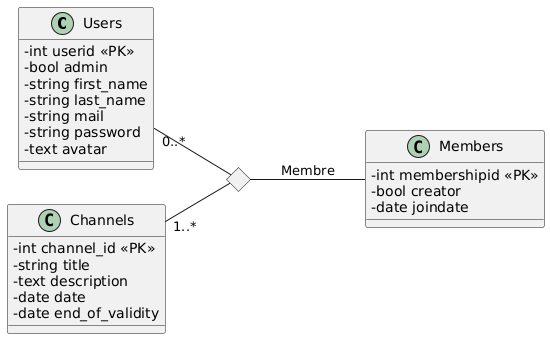
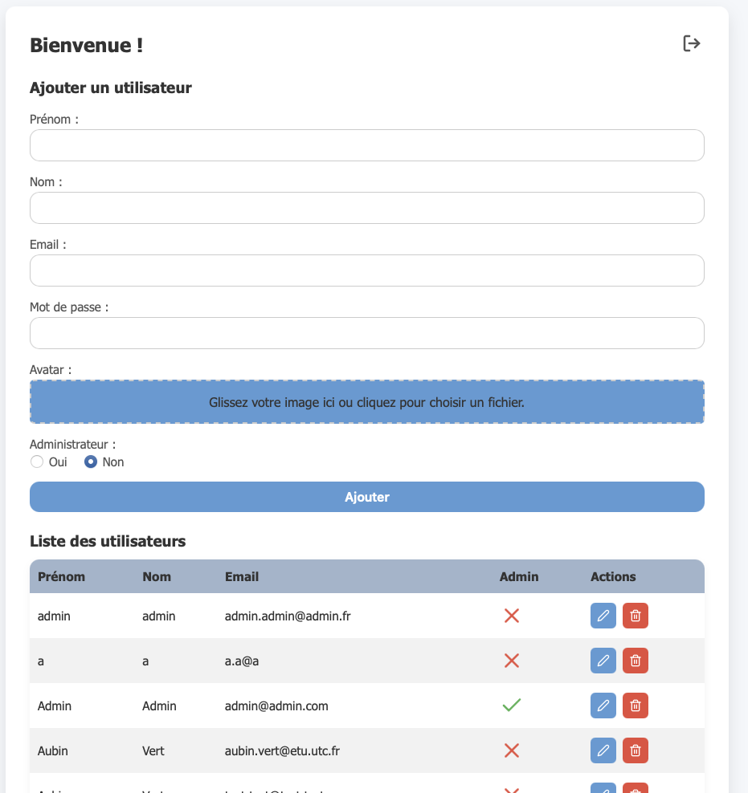
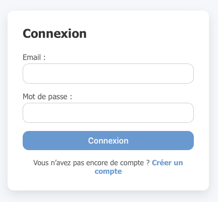
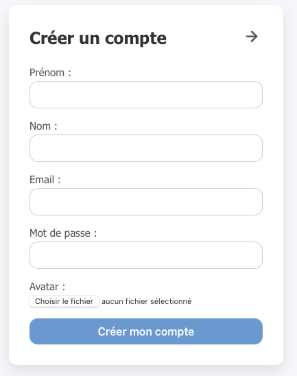
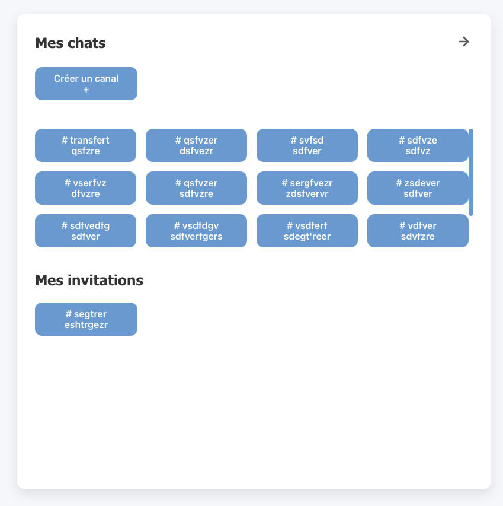
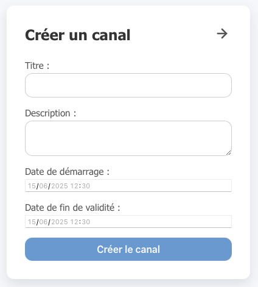
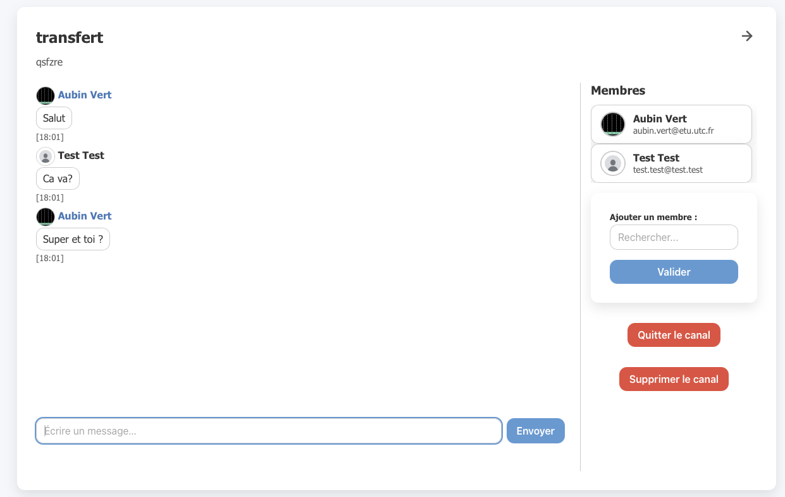
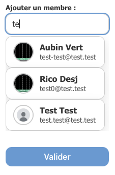
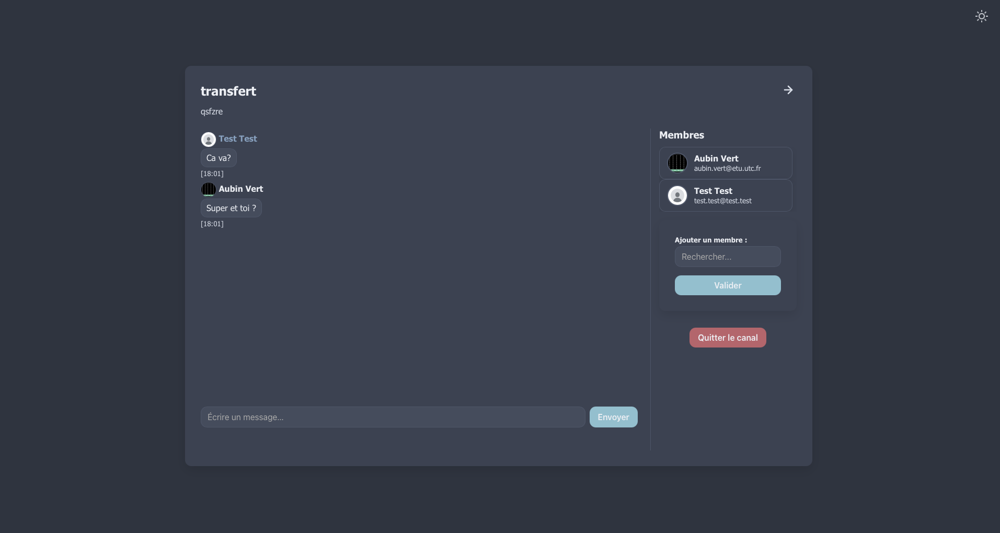

# Projet de chat SR03

Ce document présente l'architecture choisie, les principaux choix effectués et difficultés rencontrés dans la conception de notre application 
web de chat.

## Remerciements
Nous souhaitons particulièrement remercier notre enseignant pour sob aide dans la conduite de ce projet.
Il nous a permis d'apprendre de nombreuses nouvelles notions qui nous seront très utiles pour notre future vie d'ingénieur.

## Le modèle de donnée

Nous avons choisi d'utiliser le modèle de donnée ci-dessous :

La table Members joue ici le rôle de table d'association (enrichie avec quelques attributs).

## Les technologies utilisées

Nous avons utilisé Java avec le framework Spring. Pour la gestion de données, nous avons fait le choix de Postgres SQL.

Notre application web se sépare en deux parties : 

- La première, l'interface administrateur, utilise un controller classique (appelé WebController, avec l'architecture MVC par la partie back-end. Pour le
front-end de cette partie, nous avons utilisé Javascript et Thymeleaf en plus d'html.

- La seconde est l'interface utilisateur. Elle utilise un controller REST, que l'on vient interroger dans notre application
web developpée avec React.js.

## L'interface administrateur

Cette interface offre la possibilité aux administrateurs de gérer tous les utilisateurs. Elle consiste en un affichage des différents
utilisateurs, avec la possibilité d'en ajouter, de les modifier, voire de les supprimer : 

À noter ici, que la suppression d'un utilisateur entraine son retrait de tous les canaux dont il est membre, et le passage
du rôle de créateur du canal à un autre utilisateur (s'il l'avait). Dans le cas ou il était seul dans le canal, le canal est supprimé.

## Page de connexion et de création de compte

Pour accéder à l'interface utilisateur, il faut bien évidemment se loguer :

Ou bien créer un compte : 

## Interface utilisateur

Cette interface est celle utilisée par l'ensemble des utilisateurs souhaitants utiliser des canaux de discussions :

Les canaux sont séparés en deux groupes. 

- Ceux du groupe "Mes chats" sont les canaux créés par l'utilisateur. Ils sont
visibles par l'utilisateur jusqu'à leur date de fin de validité (après laquelle ils sont supprimés).

- Ceux du groupe "mes invitations" sont les canaux dans lesquels l'utilisateur a été invité. Ils ne sont visibles qu'à partir
de leur date de début, et jusqu'à leur date de fin (après laquelle ils sont supprimés).

En cliquant sur le bouton "Créer un canal", il est possible d'en créer un nouveau :

Lorsque l'on clique sur l'un des boutons pour accéder aux canaux, on arrive alors sur l'interface de discussion : 

À travers cette page, il est possible de discuter en temps réel avec les membres du canal connectés.

Un utilisateur peut également quitter le canal et ajouter d'autres utilisateurs au chat.

L'utilisateur administrateur peut en plus supprimer des membres du canal, ou même supprimer le canal.

Pour supprimer des membres, il suffit de cliquer sur leur nom dans le menu à droite.

## Choix
Pour l'ensemble de l'application sauf pour les messages, nous avons utilisé le protocol HTTP couplé à nos deux controllers.
Pour les messages, conformément aux consignes, nous avons utilisé le protocole Websocket.

Nous avons aussi souhaité ajouter une sécurisation des mots de passe. Pour cela, nous avons ajouté des contraintes sur ceux-ci : 
- 15 caractères au minimum, 
- 1 majuscule au minimum,
- 3 chiffres au minimum,
- 2 caractères spéciaux au minimum.

En plus de cela, nous avons crypté les messages mis en base.

Enfin, nous avons offert la possibilité aux utilisateurs de donner un avatar lors de la phase de création de leur compte.
Celui-ci est ainsi affiché à côté de leur nom dans les discussions, ou dans les listes de membres.
Dans le cas où l'utilisateur n'en ajoute pas, un avatar par défaut est choisi.

Pour une meilleure ergonomie, nous avons décidé de mettre en plus un système de suggestion des utilisateurs dans le composant d'ajout d'utilisateurs 
aux discussions :

Finalement, pour le confort visuel, nous avons ajouté un mode sombre à notre application. Pour l'activer, il suffit de 
cliquer sur l'icone en haut à droite de l'écran : 

## Difficultés rencontrées
Dans le cadre de ce projet, nous avons dû apprendre à mettre en place une architecture MVC ainsi qu'un controller Spring REST. 
N'ayant pas de connaissances sur le sujet avant le suivi de l'UV, nous avons parfois commis des erreurs d'implémentation des controllers,
souvent par manque d'anticipation des comportements attendus. Il a donc fallu à plusieurs reprises réadapter nos controllers.

La gestion des suppressions en cascade des canaux et utilisateurs pour garantir la cohérence de la base s'est également
avérée fastidieuse. Nous avons malgré tout réussi à la mettre en place en les gérant directement dans notre architecture, 
plutôt qu'en utilisant les suppressions en cascade de Postgres, comme nous l'a recommandé notre enseignant.

Enfin, nous avons rencontré des difficultés dans la gestion de la sécurité de notre application. En effet, pour des tests 
sur nos machines personnelles, nous avons dû ajouter une gestion du CORS, empêchant les requêtes de localhost:3000 vers 
localhost:8080. De plus, dans notre gestion de la sécurité, nous avons laissé toutes les requêtes en "permitAll()", elles sont
donc accessibles sans token. Nous avons conscience que dans un cadre réel, cela occasionnerait de gros problèmes de 
sécurité, car les appels à nos controllers sont ouverts à tous.
